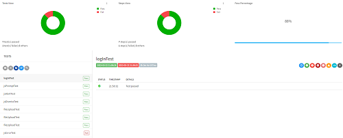
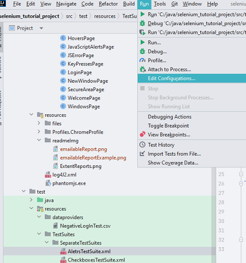
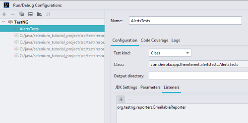
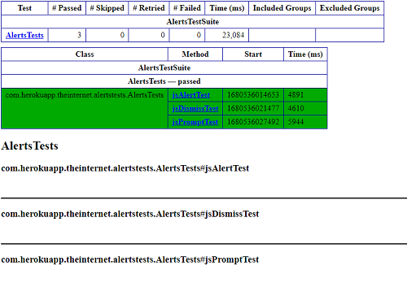
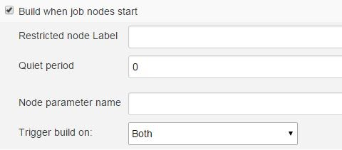

# Selenium-Tutorial-Demo
Following **Udemy** course [https://www.udemy.com/course/advanced-selenium-webdriver/](https://www.udemy.com/course/advanced-selenium-webdriver/). Project contains some additional features, described in this file.
## Using **WebDriverManager**
In the Udemy tutorial ** org.openqa.selenium.WebDriver** instance is used to run tests with Selenium. Path to drivers for all browsers used by Selenium needs to be defined using command like:\
`System.setProperty("webdriver.chrome.driver", "src/main/resources/chromedriver.exe");`.\
Drivers also have to be up-to-date with corresponding browser version and corret versions need to be regularly downloaded.
In this demo project, class **io.github.bonigarcia.wdm.WebDriverManager** is instantiated to define **driver** variable. Corresponding Maven dependecy is added to **pom.xml** file:
``` 
<dependency>
<groupId>io.github.bonigarcia</groupId>
<artifactId>webdrivermanager</artifactId>
<version>5.3.2</version>
</dependency>
```
This approach doesn't require downloading specific browser drivers, driver instance is created by calling corresponding constructor, for example:\
`WebDriver driver = new FirefoxDriver();`
- **Note**: After Chrome browser 1.1.0 and ChromeDriver update there is forbidden access issue. Adding argument **"--remote-allow-origins=*"** to the options object is necessary for chromeDriver to work. Example:
```
 WebDriverManager.chromedriver().setup();              
 chromeOptions.addArguments("--remote-allow-origins=*");
 driver = new ChromeDriver(chromeOptions);
```
## Project structure
**P**age **O**bject **M**odel design pattern is used to reduce test duplication and enable easier maintenance.  enhancing test maintenance and reducing code duplication. An object-oriented class is created for every page of the application under test (AUT) that serves as an interface to each page. The tests then use the methods of this page object class whenever they need to interact with the UI of that page. The benefit is that if the UI changes for the page, the tests themselves don’t need to change, only the code within the page object needs to change. Subsequently, all changes to support that new UI are located in one place.

Package **base** in the Sources Root folder (/src/main/java folder marked as sources root by Maven) contains classes with methods that are called several times for testing multiple different pages. It contains following classes:
   1. **BaseTest.java** with variables and methods used throughout all tests. For example, here the **driver** variable is created, the log variable for log4j logging, and also methods that are executed before and after every test (setup method and tearDown to stop driver).
   2. **BrowserDriverFactory.java** initializes the driver variable depending on the parameters for each test. It contains several methods that used different approaches to initialize the driver, like creating driver with browser profile, creating driver used for selenium grid tests, initializing driver for mobile emulation and so on.
   3. Helper classes **CsvDataProviders.java** and **ExtentReporterNG**, used as selenium TestNG data providers required for Selenium Data Driven Framework and generating TestNG reports correspondingly. Class **TestListener.java** implements ITestListener interface which is part of the so called TestNG listeners interfaces. They are used to modify TestNG behavior. In this project it is used to add logging data like test name from class and test name from test suite or started test.
   4. **TestUtilities.java** is the parent class of all test classes in Test Sources Root directory (/src/test/java directory). It extends **BaseTest.java** and has some additional methods for getting browser logs, creating data provider and so on.

- Package **pages** contains all classes that represent a page from the application under test. Class **BasePageObject.java** is the parent class for pages classes. Contains variables and methods used on multiple pages. 
- Package **com.herokuapp.theinternet** located in the Test Sources Root directory (/src/test/java) contains all the test classes with corresponding test methods.
- Test Resources Root directory (/src/test/resources) contains **TestSuites** directory where all the **xml** files containing test suites are stored. We use these files to execute tests from specific test classes while passing specific parameters and potentially using listeners.

## Generating reports using **ExtentReporterNG**
- Detailed explanation can be found here [https://www.ontestautomation.com/using-the-extentreports-testng-listener-in-selenium-page-object-tests/](https://www.ontestautomation.com/using-the-extentreports-testng-listener-in-selenium-page-object-tests/).
- Suitable dependencies are added:
```  <!-- https://mvnrepository.com/artifact/com.relevantcodes/extentreports -->
        <dependency>
            <groupId>com.relevantcodes</groupId>
            <artifactId>extentreports</artifactId>
            <version>2.41.2</version>
        </dependency>
  ```      
- Class **ExtentReporterNG.java** implements IReporter interface. In this class, method **generateReport** is overridden in order to generate report. Created listener for generating extent report is used in **SmokeTestSuite**:
```
 <listeners>
        <listener class-name="com.herokuapp.theinternet.base.ExtentReporterNG"></listener>
    </listeners>
```
- When we run **SmokeTestSuite.xml** file, an ExtentReports HTML report is created in the default test-output folder.

  

## Generating emailable-reports
- From project tree select the test class or test suite you want to run and generate HTML report for. From menu **Run** select **Edit configurations...**.

  

- In the Listeners tab add emailable report (click **+** icon and start writing emailable, you will be offered two options and you can pick any of them).



- Example for generater report:

  

## Running tests on Selenium Grid
- Setting up Selenium Grid is the first step. For tests in this project two grids are used because of configuration issues regarding MicrosoftEdge browser. Docker images for Selenium Grid hub with ip `http://40.114.204.255` on port `4444` and three nodes for browsers Chrome, Firefox and MS Edge are pulled and grid is set up using **docker-compose.yml** file. Examples can be found here: [https://github.com/SeleniumHQ/docker-selenium](https://github.com/SeleniumHQ/docker-selenium). Second grid is set up using docker image for **selenium/standalone-edge**.
 1. Pull the image using Docker command: `docker pull selenium/standalone-edge`. This will allow you to control a MicrosoftEdge browser instance running inside a container.
 2. Use the following Docker command to create a container with the image you have just pulled:\
```docker run -d -p 4444:4444 -p 7900:7900 --shm-size="2g" selenium/standalone-edge```.\
With this command it is specified that the Docker container will run in detached mode. After specifying the mode, container’s ports 4444 and 7900 are mapped to machine’s ports 4444 and 7900, respectively. You will be able to control a MS Edge browser instance by pointing tests to the URL http://localhost:4444 (corresponding IP address can be used instead of localhost) and see what is happening in your container by visiting the URL http://localhost:7900 (The password is secret). Lastly, shared memory size needs to be set to 2g because a container running a selenium/standalone-edge image requires more shared memory than the default 64M that Docker containers have allocated.
 3. To see Docker container ID use command: 'docker ps'.
 4. Container's ID can be used to stop or run created container when needed: `docker start 81bd6ece5943` or `docker stop 81bd6ece5943` (replace example value for ID with corresponding).

- To run tests remotely on Selenium Grid, an instance of the **RemoteWebDriver** class is required. For this purpose a method is added to the base class **BrowserDriverFactory** used for creating corresponding RemoteWebDriver instance. Capabilities and options for this instance vary depending on the browser parameter passed in the test suite **.xml** file or passed with maven command. Method **createDriverGrid** provides corresponding WebDriver instance.
To run tests on Selenium Grid, the same pages and tests classes can be used. Classes in the **src\main\java\com\herokuapp\theinternet\pages** directory have **BasePageObject.java** as parent and inherit all the needed methods and variables while also containing page specific ones declared in the class itself. Test classes from the **\src\test\java\com\herokuapp\theinternet** directory inherit base methods and variables needed for all tests defined in **BaseTest.java** via their parent class **TestUtilities.java**. This means that methods **setup** and **tearDown** are inherited from **BaseTest.java** which is parent class of **TestUtilities.java**.
To run tests remotely only test parameters need to be changed in order for the correct type of driver to be instantiated by calling corresponding method from **BrowserDriverFactory.java**.
### Running tests on Selenium Grid using test suite **.xml** files
Test Suites for remote testing are located in directory **src\test\resources\TestSuites\GridTestSuites**. Parameters **environment**, **browser** and **ip** need to be defined in order to run tests remotely.
- **Note**: When testing file upload tests additional parameter **enableFileUpload** is passed with value "true". This parameter is used in method **createDriverGrid** of **BrowserDriverFactory.java** class in order to detect files on the local disk: ` ((RemoteWebDriver) driver).setFileDetector(new LocalFileDetector());`.
### Running Selenium Grid tests from command line
Inbuilt terminal in InteliJ can be used for this purpose. Also, default tests suite file is specified in **pom.xml** file. Any test suite can be used as default, simply swap **DragAndDropTestSuite** for name of desired suite.
```
 <!-- Specifying Default suite files if not being specified from mvn command line -->
        <smokeSuiteFile>src\test\resources\TestSuites\SeparateTestSuites\DragAndDropTestSuite.xml</smokeSuiteFile>
        <!-- Default suite files if not being specified from mvn command line -->
        <defaultSuiteFiles>${smokeSuiteFile}</defaultSuiteFiles>
        <suiteFile>${defaultSuiteFiles}</suiteFile>
```
To execute test maven command similar to the following can be used:
```
 mvn clean test -U -X -DsuiteFile='src\test\resources\TestSuites\SeparateTestSuites\HoversTestSuite.xml' -Dbrowser=chrome -Denvironment=grid -Dip='40.114.204.255:4444'
```
Values for necessary parameters **browser**, **environment** and **ip** need to be specified for test to be executed on previously configured grid.
- **Note**: When running file upload tests on Selenium grid, value for parameter **enableFileUpload** needs to be set to "true":
```
mvn clean test -DsuiteFile='src\test\resources\TestSuites\GridTestSuites\GridTestSuiteEdge.xml' -Dbrowser=microsoftedge -Denvironment=grid -Dip='192.168.1.111:4444' -DenableFileUpload=true
```
### Running Selenium Grid tests with Jenkins
First step is to add **Maven Integration Plugin** form the list of available plugins in **Manage Plugins** section of **Manage Jenkins** window. Once plugin is installed and active, in the **Global Tool Configuration** window we can add **Maven Installation** by selecting **Install automatically** and choosing specific version to install from Apache. 
After that, new pipeline job can be created and a script similar to the following can be used to run tests:
```
pipeline{
    agent any    
    tools{       
        maven 'mvn_3.8.6'
    }
    stages{
        stage ('checkout'){
            steps{
            checkout scmGit(branches: [[name: '*/master']], extensions: [], userRemoteConfigs: [[credentialsId: 'my_credentials', url: 'https://github.com/KaterinaN86/Selenium-Tutorial-Demo.git']])
            }
        }       
            stage('Build') {
                steps {
                sh 'mvn clean test site surefire-report:report -U -X -DsuiteFile=src/test/resources/TestSuites/SeparateTestSuites/KeyPressesTestSuite.xml -Dbrowser=firefox -Denvironment=grid -Dip=40.114.204.255:4444'
                }
            }
    }
    post {
        success {
            publishHTML([allowMissing: false, alwaysLinkToLastBuild: false, keepAll: true, reportDir: 'target/site', reportFiles: 'surefire-report.html', reportName: 'Surefire Report', reportTitles: '', useWrapperFileDirectly: true])
        }
    }
}
```
- **Note**: In example pipeline, **SureFire Report** html file is generated in the post stage if other stages completed successfully. To generate report, two plugins have been added to **pom.xml** file: maven-site-plugin and maven-project-info-reports-plugin. In stage **Build** `site surefire-report:report` is also added to maven command. Process is described in more detail in this video: [https://www.youtube.com/watch?v=X69Ybd4Iaps](https://www.youtube.com/watch?v=X69Ybd4Iaps).

To display report CSS following plugins have been installed: [https://wiki.jenkins-ci.org/display/JENKINS/Startup+Trigger] (https://wiki.jenkins-ci.org/display/JENKINS/Startup+Trigger) and [https://wiki.jenkins-ci.org/display/JENKINS/Groovy+plugin] (https://wiki.jenkins-ci.org/display/JENKINS/Groovy+plugin). Then a freestyle job is created that starts on Jenkins restart:

  

and the following groovy script is added in the **Groovy command** field of the **execute system Groovy script** section (**Build Steps** segment): 
```
System.setProperty("hudson.model.DirectoryBrowserSupport.CSP", "sandbox allow-same-origin allow-scripts; default-src 'self'; script-src * 'unsafe-eval'; img-src *; style-src * 'unsafe-inline'; font-src *")
```
